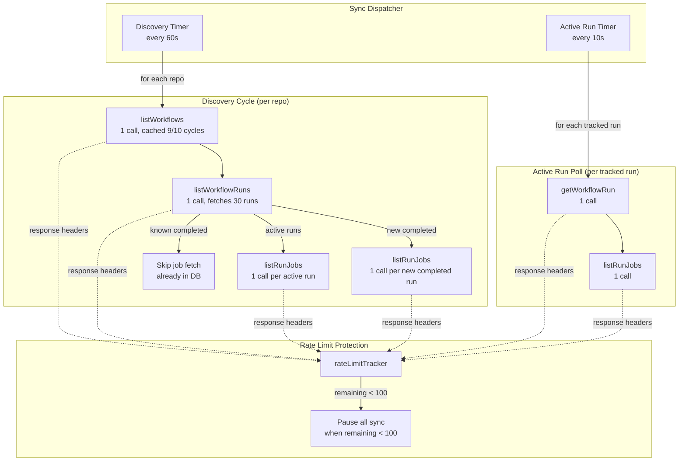
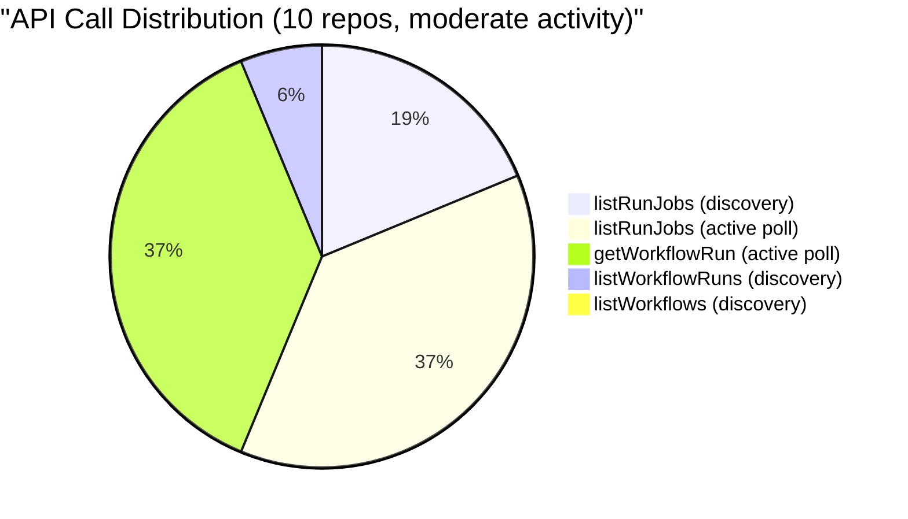
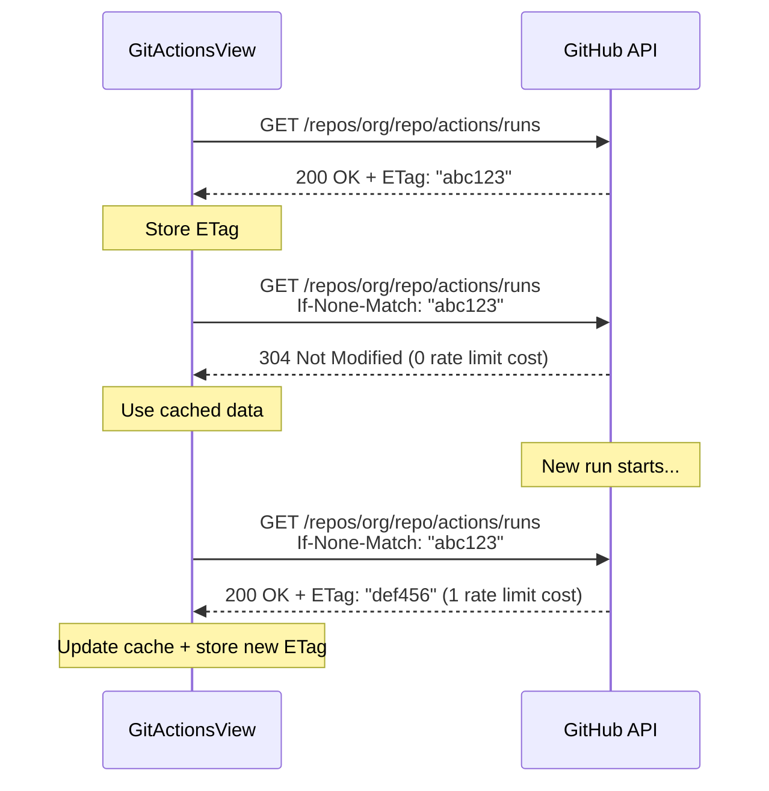
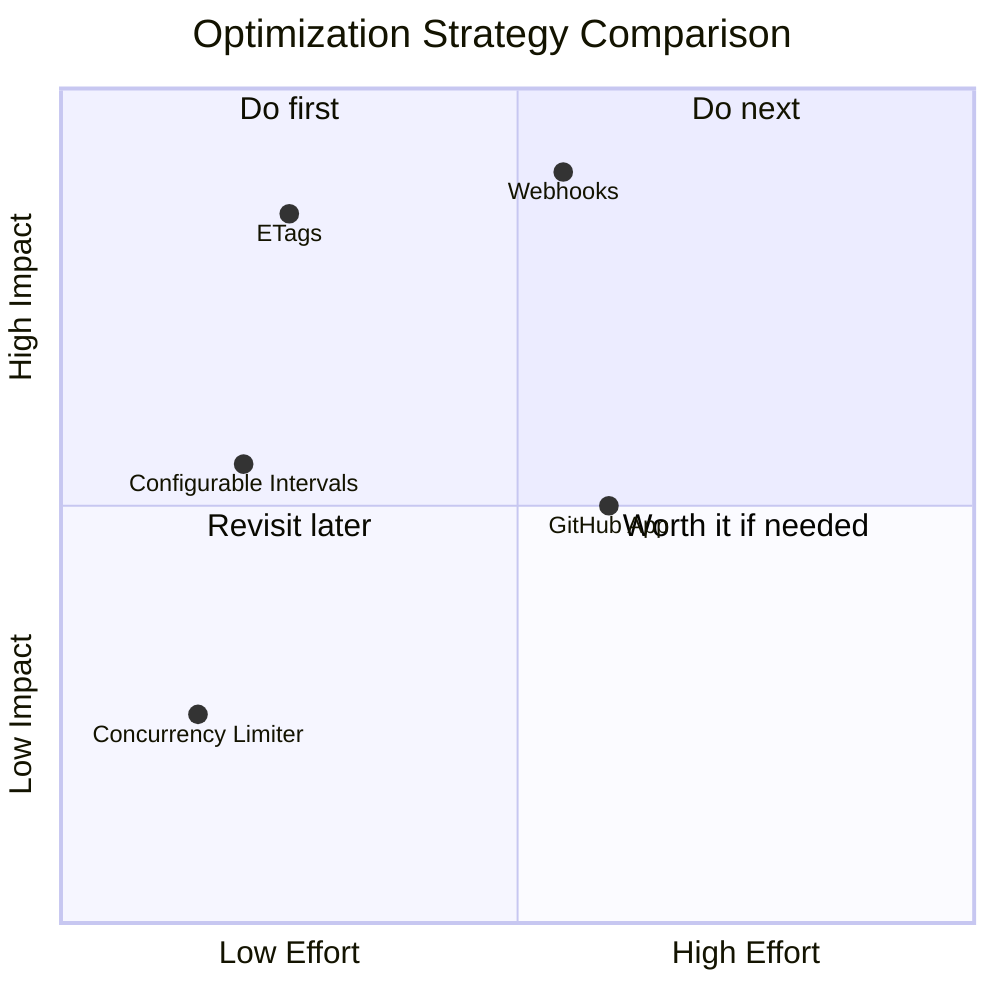

# GitHub API Usage & Optimization Guide

## Current Architecture

GitActionsView uses a two-tier polling system to monitor GitHub Actions workflow runs. A background **discovery poll** fetches recent runs for all monitored repos, while a faster **active run poll** tracks in-progress runs until completion.



### API Endpoints Used

| Function | GitHub API Endpoint | When Called |
|---|---|---|
| `listWorkflows` | `GET /repos/{owner}/{repo}/actions/workflows` | Discovery (cached for 10 cycles) |
| `listWorkflowRuns` | `GET /repos/{owner}/{repo}/actions/runs?per_page=30` | Every discovery cycle |
| `listRunJobs` | `GET /repos/{owner}/{repo}/actions/runs/{id}/jobs?filter=latest` | Conditionally per run |
| `getWorkflowRun` | `GET /repos/{owner}/{repo}/actions/runs/{id}` | Active run poll |

### Current Optimizations

1. **Workflow caching**: `listWorkflows` results are cached in memory for 10 discovery cycles (~10 min). Saves ~0.9 calls/repo/cycle.
2. **Job skip for completed runs**: `listRunJobs` is skipped for completed runs that already have jobs with conclusions in the database. This is the biggest optimization — in steady state, most of the 30 runs per repo are completed with existing jobs.
3. **Rate limit tracking**: Response headers (`x-ratelimit-remaining`) are monitored on every API call. All sync pauses when remaining drops below 100, and auto-resumes after the rate limit window resets.
4. **ETag conditional requests**: All API calls include `If-None-Match` headers with cached ETags. When data hasn't changed, GitHub returns `304 Not Modified` — which does **not** count against the rate limit. In steady state, most discovery calls return 304, reducing effective rate consumption to near-zero.
5. **GitHub Webhooks** (optional): When `GITHUB_WEBHOOK_SECRET` is configured, `workflow_run` and `workflow_job` events push real-time updates. Polling intervals automatically increase to 5 min / 60 s for reconciliation only. Supports [smee.io](https://smee.io/) proxy via `SMEE_URL` for environments behind NAT/firewalls.

---

## API Call Analysis

### Per Discovery Cycle (per repo)

| Call | Count | Notes |
|---|---|---|
| `listWorkflows` | 0.1 (amortized) | Cached 9/10 cycles |
| `listWorkflowRuns` | 1 | Always fetches 30 most recent |
| `listRunJobs` (active) | 0-N | 1 per active run |
| `listRunJobs` (new completed) | 0-30 | 1 per completed run without jobs in DB |
| **Steady state total** | **~1.1** | All jobs already cached |
| **Cold start total** | **~31.1** | All 30 runs need job fetching |

### Per Active Run Poll Cycle (per tracked run)

| Call | Count |
|---|---|
| `getWorkflowRun` | 1 |
| `listRunJobs` | 1 |
| **Total per run** | **2** |

### Calls/Hour by Repo Count

#### Best Case: Steady State (no active runs, all jobs cached)

| Repos | Discovery calls/hr | Active poll calls/hr | **Total/hr** | **% of 5,000 limit** |
|---|---|---|---|---|
| 5 | 330 | 0 | **330** | 7% |
| 10 | 660 | 0 | **660** | 13% |
| 20 | 1,320 | 0 | **1,320** | 26% |
| 50 | 3,300 | 0 | **3,300** | 66% |

#### Moderate Case: 1 active run per repo, 3 new completed runs/cycle

| Repos | Discovery calls/hr | Active poll calls/hr (@10s) | **Total/hr** | **% of 5,000 limit** |
|---|---|---|---|---|
| 5 | 1,530 | 3,600 | **5,130** | 103% |
| 10 | 3,060 | 7,200 | **10,260** | 205% |
| 20 | 6,120 | 14,400 | **20,520** | 410% |

#### Worst Case: Cold start (all 30 runs need jobs)

| Repos | Discovery calls/hr | **Total/hr** |
|---|---|---|
| 5 | 9,330 | **9,330+** |
| 10 | 18,660 | **18,660+** |

### Key Takeaways



1. **`listRunJobs` is the biggest cost driver** — called once per run that needs jobs during discovery, plus once per active run every 10 seconds.
2. **Active run polling dominates** when runs are in-progress — 2 calls per run every 10 seconds = 720 calls/hr per active run.
3. **The job skip optimization is critical** — without it, 30 job fetches per repo per cycle would be 18,000 calls/hr for 10 repos.
4. **Steady state is efficient** — with all jobs cached, the system uses only ~13% of the rate limit for 10 repos.

---

## Optimization Strategies

### 1. Conditional Requests with ETags — IMPLEMENTED

**Impact: High | Effort: Low**

GitHub's REST API supports conditional requests via `ETag` / `If-None-Match` headers. When data hasn't changed, GitHub returns `304 Not Modified` — and **304 responses do not count against the rate limit**.



**Implementation**: Implemented in `githubApi.js` via axios request/response interceptors. A module-level `Map` stores ETags per URL. The request interceptor attaches `If-None-Match`, and the response interceptor caches new ETags on 200 and returns cached data transparently on 304.

**Expected savings**: In steady state (no new runs), nearly all discovery calls return 304, reducing effective rate consumption to near-zero. During active periods, only the endpoints with actual changes cost rate limit quota.

### 2. GitHub Webhooks — IMPLEMENTED (Optional)

**Impact: High | Effort: Medium**

Webhooks push events to your server in real-time, eliminating the need to poll for changes.

```mermaid
flowchart LR
    subgraph GitHub
        WR[workflow_run event]
        WJ[workflow_job event]
    end

        WH[Webhook Endpoint<br/>/api/v1/webhooks/github]
        SSE[SSE Broadcast]
    end

    WR -->|"POST (requested/in_progress/completed)"| WH
    WJ -->|"POST (queued/in_progress/completed)"| WH
    WH --> DB
    WH --> SSE

    subgraph Fallback["Reconciliation Poll (every 5-10 min)"]
        POLL[Discovery sync]
    end

    POLL -.->|"catch missed events"| DB
```

**Relevant events**:
- `workflow_run` — fires when a run is requested, starts, or completes. Payload includes the full run object.
- `workflow_job` — fires when a job is queued, starts, or completes. Payload includes the full job object with steps.

**Implementation**: Enabled by setting `GITHUB_WEBHOOK_SECRET`. The webhook endpoint at `POST /api/v1/webhooks/github` verifies HMAC-SHA256 signatures using Node.js `crypto` (no external library). Processes `workflow_run` and `workflow_job` events, upserts data via existing `syncService` functions, and broadcasts SSE updates. For containers behind NAT, set `SMEE_URL` to a [smee.io](https://smee.io/) channel (requires `smee-client` package). When webhooks are enabled, polling intervals automatically increase to 300s / 60s for reconciliation.

**Expected savings**: Eliminates active run polling entirely (720 calls/hr per active run). Reduces discovery to a lightweight reconciliation poll. Total API usage drops to ~50-100 calls/hr regardless of activity level.

### 3. GitHub App Authentication

**Impact: Medium | Effort: Medium**

GitHub Apps get higher rate limits than PAT tokens, scaling with the number of repos and org members.

| Auth Method | Rate Limit |
|---|---|
| Personal Access Token (PAT) | 5,000/hr (fixed) |
| GitHub App (installation token) | 5,000 base, up to **12,500/hr** |
| GitHub App (Enterprise Cloud) | **15,000/hr** |

**Scaling formula**: `5,000 + (repos beyond 20 * 50) + (org members beyond 20 * 50)`, capped at 12,500.

**Additional benefits**:
- Not tied to a personal account (survives user departure)
- Fine-grained permissions (read-only Actions access)
- Built-in webhook configuration
- Short-lived tokens (more secure than long-lived PATs)

**Tradeoff**: Requires JWT-based token exchange (tokens expire every 60 min). Libraries like `@octokit/app` handle this automatically but add setup complexity.

### 4. User-Configurable Polling Intervals

**Impact: Medium | Effort: Low**

The polling intervals are already configurable via Settings, but users may not understand the API cost implications. Consider:

- **Display current API usage** in the Settings page (calls/hr estimate based on repo count and intervals)
- **Recommend intervals** based on the number of monitored repos
- **Per-repo polling** — allow users to set different intervals per repo (e.g., poll critical repos every 30s, others every 5 min)
- **Pause individual repos** — the `hidden` flag already exists on repos; expose a "pause sync" option

Suggested defaults by repo count:

| Repos | Discovery Interval | Active Poll Interval |
|---|---|---|
| 1-5 | 30s | 10s |
| 6-15 | 60s | 15s |
| 16-30 | 120s | 30s |
| 30+ | 300s | 60s |

### 5. Concurrent Request Limiting

**Impact: Low (safety) | Effort: Low**

GitHub enforces a secondary limit of **100 concurrent requests**. During initial sync or cache rebuild, fetching jobs for many repos in parallel could hit this. Add a concurrency semaphore to `syncRepoRuns` limiting parallel job fetches to 10-20 at a time.

---

## Strategy Comparison



| Strategy | Impact | Effort | When to Use |
|---|---|---|---|
| **ETags** | High | Low | **Done.** Implemented in `githubApi.js`. |
| **Webhooks** | High | Medium | **Done.** Optional via `GITHUB_WEBHOOK_SECRET`. |
| **Configurable intervals** | Medium | Low | **Do alongside ETags.** Surface API cost to users. |
| **GitHub App** | Medium | Medium | When you need >5,000 calls/hr or integrated webhooks. |
| **Concurrency limiter** | Low | Low | Add defensively for cold start / rebuild scenarios. |

---

## GitHub Rate Limit Reference

### Primary Limits

| Auth Method | Limit | Shared Across |
|---|---|---|
| Unauthenticated | 60/hr | Per IP |
| PAT / OAuth token | 5,000/hr | Per user (all tokens) |
| GitHub App installation | 5,000-12,500/hr | Per installation |

### Secondary Limits

| Limit | Value | Notes |
|---|---|---|
| Points per minute (REST) | 900 | GET=1 point, POST=5 points |
| Concurrent requests | 100 | Shared across REST + GraphQL |
| Content creation | 80/min, 500/hr | Not relevant for read-only monitoring |

### Rate Limit Headers

Every GitHub API response includes:
- `x-ratelimit-limit` — Total allowed per hour
- `x-ratelimit-remaining` — Remaining in current window
- `x-ratelimit-reset` — Unix timestamp when the window resets
- `x-ratelimit-used` — Used in current window
- `x-ratelimit-resource` — Which rate limit pool (core, search, graphql)

### Conditional Requests (304)

Responses returning `304 Not Modified` do **not** decrement `x-ratelimit-remaining`. This is the single most impactful optimization for polling-based architectures.

---

## GraphQL API

The GitHub GraphQL API is **not recommended** for this use case. While it has the same 5,000 point/hr rate limit, it has poor coverage for Actions data:
- No direct `repository.workflowRuns` or `repository.workflows` queries
- Must traverse `Commit -> CheckSuites -> WorkflowRun` (awkward for listing recent runs)
- No job step details
- No filtering by run attempt

The REST API provides direct, filterable access to exactly the data GitActionsView needs.
